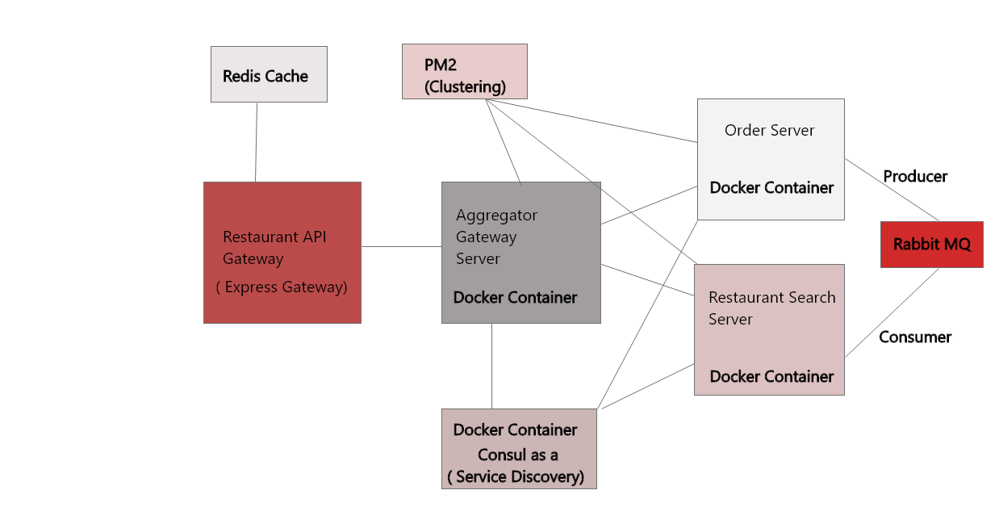

# AggregatorGatewayServer
- It is a aggregator gateway server of [order server](https://github.com/imdeepanshugpt/orderServer) and [restaurant server](https://github.com/imdeepanshugpt/restaurantServer).
- It is used to connect both order server and restaurant server.
- It is used to make aggergate queries and fetching data from order server and restaurant server.
- There are two API's are created for aggergate queries /todaysOrder and /todaysRevenue of a multiple restaurants of a city.

**Clustering, Service Discovery**

**Technology Used: NodeJS, Express JS, Consul, PM2, Docker.**
# MicroServices Architecture

# How to run this server

**This server is using consul configuration code so first pull the consul image from docker hub by using following command and launch the container**

- docker pull consul
- docker run -d -p 8500:8500 -p 8600:8600/udp --name=badger consul agent -server -ui -node=server-1 -bootstrap-expect=1 -client=0.0.0.0

**Take the IP of consul running container and replace it with config/consul.js at line 21 host IP.**
- Now server is ready to run.

# You can make image of this server by using following command.
- docker build -t aggregator_server .
- docker run -it -d -p 8000:8000 aggregator_server

# You can pull the image from docker hub also.
- To run this container it requires docker consul container running at IP 172.17.0.2 
- https://hub.docker.com/r/imdeepanshu/aggregator_server
- docker pull imdeepanshu/aggregator_server
